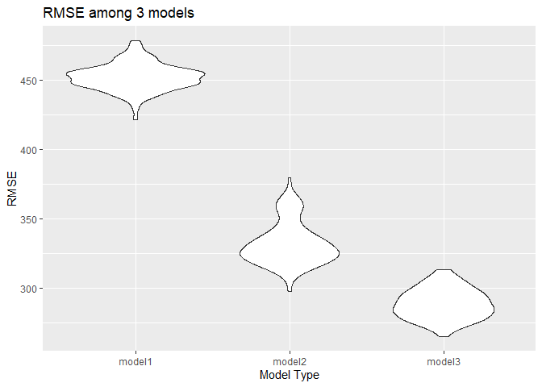

p8105_hw6_jc5929
================
2022-11-30

``` r
library(tidyverse)
library(knitr)
library(dplyr)
library(modelr)
```

## Problem 2

``` r
hom_df=read_csv("data/homicide-data.csv") %>%
  mutate(city_state=str_c(city,", ", state)) %>%
  filter(city_state != "Tulsa, AL") %>%
mutate(status=case_when(disposition=="Closed without arrest" ~ 0,
                          disposition=="Open/No arrest" ~ 0,
                          disposition=="Closed by arrest" ~ 1)) %>%
  filter(victim_race=="Black"|victim_race=="White") %>%
  mutate(victim_age=as.numeric(victim_age))
```

``` r
bm_fit= hom_df %>%
  filter(city_state=="Baltimore, MD") %>%
  glm(status~victim_age+victim_sex+victim_race,data= .,family=binomial()) %>%
  broom::tidy() %>%
  mutate(
    OR = exp(estimate),
    CI_lower = exp(estimate - 1.96 * std.error),
    CI_upper = exp(estimate + 1.96 * std.error)
  ) %>% 
  select(term, OR, starts_with("CI")) %>% 
  knitr::kable(digits = 2)
bm_fit
```

| term             |   OR | CI_lower | CI_upper |
|:-----------------|-----:|---------:|---------:|
| (Intercept)      | 1.36 |     0.97 |     1.91 |
| victim_age       | 0.99 |     0.99 |     1.00 |
| victim_sexMale   | 0.43 |     0.32 |     0.56 |
| victim_raceWhite | 2.32 |     1.65 |     3.27 |

``` r
city_data=hom_df %>%
  nest(df=-city_state) %>% 
  mutate(models=map(.x=df,~glm(status~victim_age+victim_sex+victim_race,data=.x,family = binomial())),
         results=map(models,broom::tidy)) %>%
  select(city_state, results) %>% 
  unnest(results) %>%
  mutate(
    OR = exp(estimate),
    CI_lower = exp(estimate - 1.96 * std.error),
    CI_upper = exp(estimate + 1.96 * std.error)
  ) %>% 
  select(city_state,term, OR, starts_with("CI")) 
```

``` r
 city_data %>% 
  filter(term == "victim_sexMale") %>% 
  mutate(city_state = fct_reorder(city_state, OR)) %>% 
  ggplot(aes(x = city_state, y = OR)) +
  geom_point() + 
  geom_errorbar(aes(ymin = CI_lower, ymax = CI_upper)) + 
  theme(axis.text.x = element_text(angle = 90, vjust = 0.5, hjust = 1)) +
  labs(
    title = "Estimated ORs by City")
```

<!-- -->
Most cities have an odds ratio lower than 1, indicating lower odds of
solving the homicide for male victims as compared to female victims,
there is a statistically significant association between the victim
being male and the likelihood of the homicide to go unsolved vs. the
victim being female. Albuquerque, NM have the strongest association
between victim sex and solving the homicide after controlling for victim
age and race, while New York NY has the least.

## Problem 3

``` r
bw_df= read_csv("data/birthweight.csv") %>%
  janitor::clean_names() %>% 
  mutate(
    babysex = as.factor(babysex),
    frace = as.factor(frace),
    malform = as.factor(malform),
    mrace = as.factor(mrace)
  )
```

``` r
model_fit_1 = lm(bwt ~ gaweeks + momage + mrace + fincome + pnumlbw, data = bw_df)

bw_df %>% 
  modelr::add_residuals(model_fit_1) %>%
  modelr::add_predictions(model_fit_1) %>% 
  ggplot(aes(x = pred, y = resid)) + 
  geom_point(alpha = 0.3) +
  geom_smooth(se = F, color = "red", method = "lm")+labs(
    title = "Predicted vs. Residuals",
    x = "Predicted",
    y = "Residuals"
    ) +
  theme(plot.title = element_text(hjust = 0.5))
```

<!-- -->
Based on the residual plot, the residual did not randomly distributed
along the x axis, instead most of the points clustered together when
predictied values are around 2750 \~ 3500. This further means that this
model did not fitted that well, we need to look more models that can fit
the data better.

``` r
model_2 = lm(bwt ~ gaweeks + blength, data = bw_df)
model_3 = lm(bwt ~ bhead + blength + babysex + bhead * blength + bhead * babysex + blength * babysex + bhead * blength * babysex, data = bw_df)
```

``` r
cv_df = 
  crossv_mc(bw_df, 100) %>% 
  mutate(
    train = map(train, as_tibble),
    test = map(test, as_tibble)
  )

cv_df = 
  cv_df %>% 
  mutate(
   model_fit_1 = map(.x = train, ~lm(bwt ~ gaweeks + momage + mrace + malform + parity + fincome + pnumlbw, data = .x)),
   model_2 = map(.x = train, ~lm(bwt ~ gaweeks + blength, data = .x)),
   model_3 = map(.x = train, ~lm(bwt ~ bhead + blength + babysex + bhead * blength + bhead * babysex + blength * babysex + bhead * blength * babysex, data = .x))
  ) %>% 
  mutate(
    rmse_model1 = map2_dbl(.x = model_fit_1, .y = test, ~rmse(model = .x, data = .y)),
    rmse_model2 = map2_dbl(.x = model_2, .y = test, ~rmse(model = .x, data = .y)),
    rmse_model3 = map2_dbl(.x = model_3, .y = test, ~rmse(model = .x, data = .y))
  )
```

``` r
cv_df %>% 
  select(starts_with("rmse")) %>% 
  pivot_longer(
    everything(),
    names_to = "model",
    values_to = "rmse",
    names_prefix = "rmse_"
  ) %>% 
  ggplot(aes(x = model, y = rmse)) +
  geom_violin()+labs(
    title = "RMSE among 3 models",
    x = "Model Type",
    y = "RMSE"
    ) 
```

<!-- -->

From this rmse plot, model 3 is the best model as it has the lowest
rmse. The best model among these three candidates is to use head
circumference, length, sex, and all interactions to predict baby’s
birthweight.
